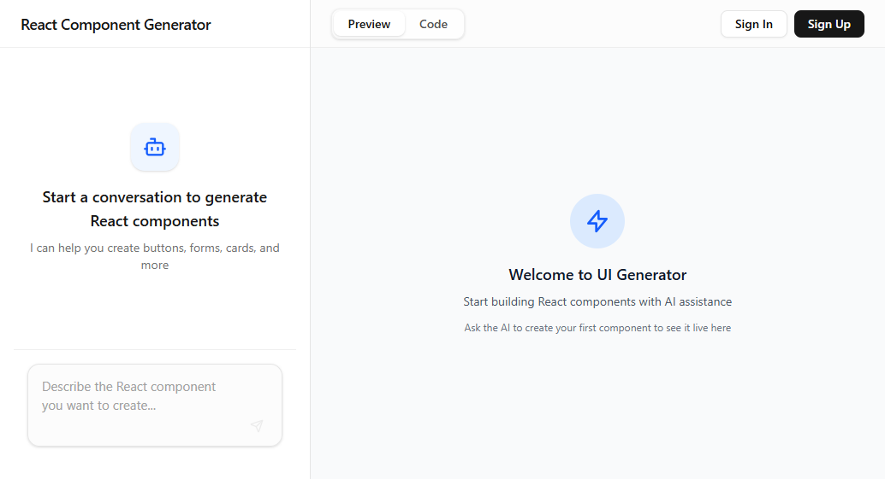

# UIGen

An AI-powered React component generator. Describe UI components in a chat interface, and Claude generates and edits files in a virtual file system that renders live in a preview pane.



## Getting Started

### Prerequisites

- [Node.js](https://nodejs.org/) v18 or later
- An [Anthropic API key](https://console.anthropic.com/) (optional — omit to use the built-in mock provider)

### Installation

1. Clone the repository:

   ```bash
   git clone https://github.com/ruben-duarte/claude-code-in-action.git
   cd claude-code-in-action/uigen/uigen
   ```

2. Run the first-time setup (installs dependencies, generates Prisma client, and runs database migrations):

   ```bash
   npm run setup
   ```

3. Configure environment variables by creating a `.env.local` file in the project root:

   ```env
   # Required for real Claude responses; omit to use the mock provider
   ANTHROPIC_API_KEY=your_api_key_here

   # Required for user authentication
   JWT_SECRET=your_jwt_secret_here

   # Optional: SQLite database path (defaults to file:./dev.db)
   DATABASE_URL=file:./dev.db
   ```

### Running Locally

Start the development server:

```bash
npm run dev
```

Open [http://localhost:3000](http://localhost:3000) in your browser. The app uses Turbopack for fast hot-module replacement.

### Other Commands

| Command | Description |
|---|---|
| `npm run build` | Create a production build |
| `npm start` | Run the production server |
| `npm run lint` | Run ESLint |
| `npm test` | Run the Vitest test suite |
| `npm run db:reset` | Drop and re-run SQLite migrations |

## Tech Stack

- **Framework**: Next.js 15 (App Router)
- **UI**: React 19, Tailwind CSS v4
- **Language**: TypeScript
- **Database**: SQLite via Prisma
- **AI**: Anthropic AI SDK (`claude-haiku-4-5`)

## How It Works

1. Describe a UI component in the chat interface.
2. Claude issues tool calls to create and modify files in a virtual (in-memory) file system.
3. A live preview iframe renders the generated components using a Babel JSX transformer.
4. Authenticated users can save projects; anonymous users work in browser `localStorage`.
